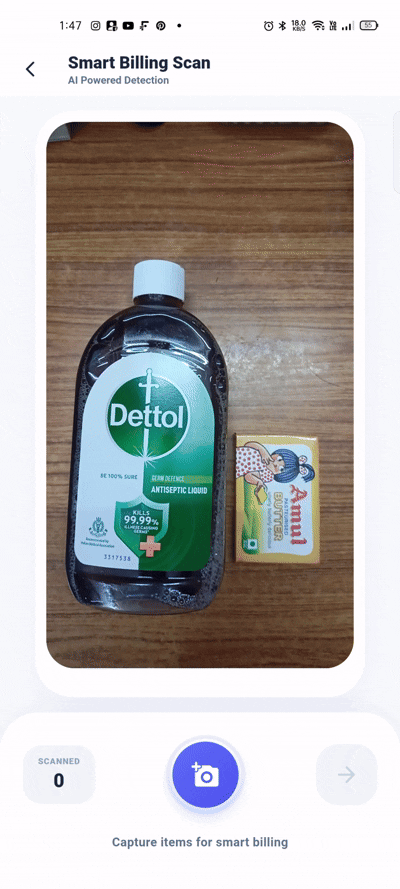
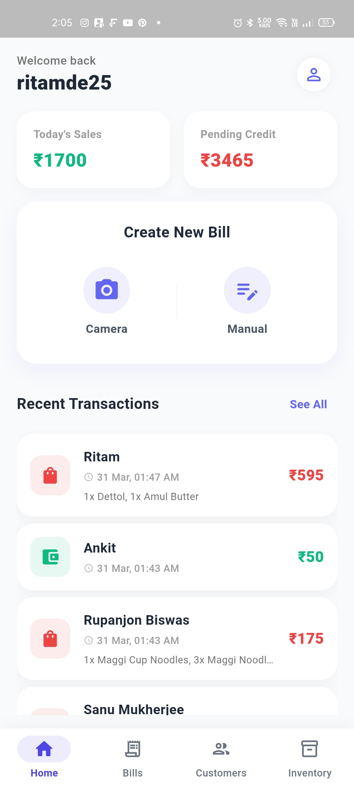
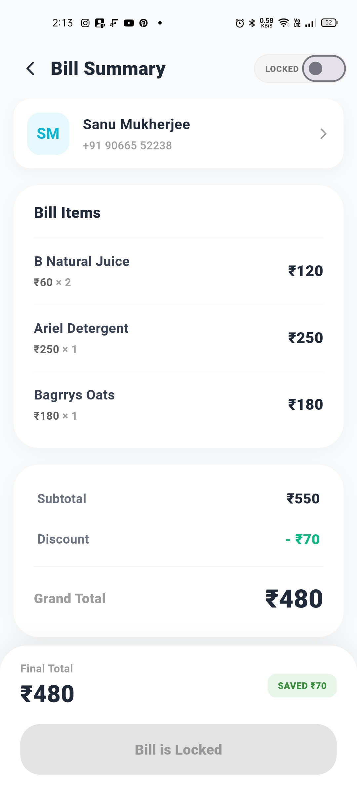
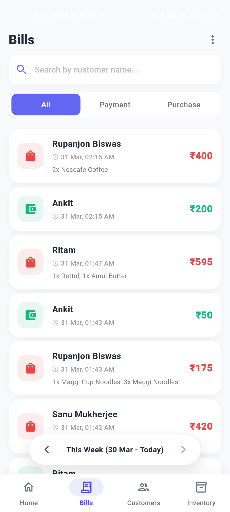
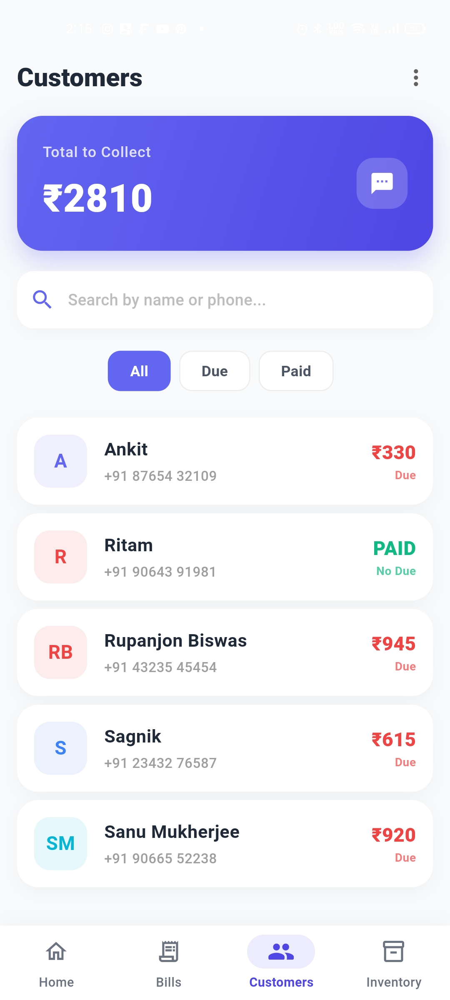
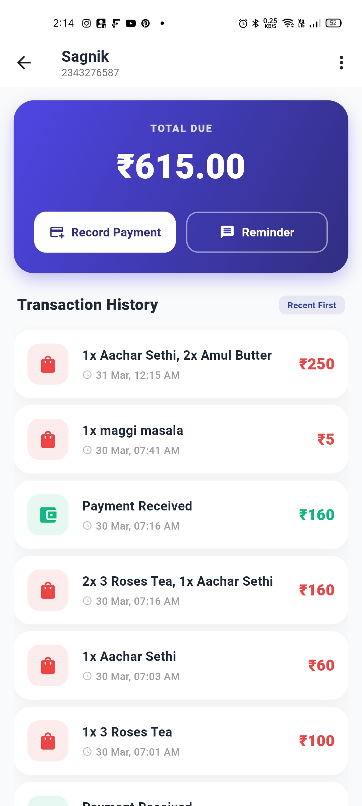
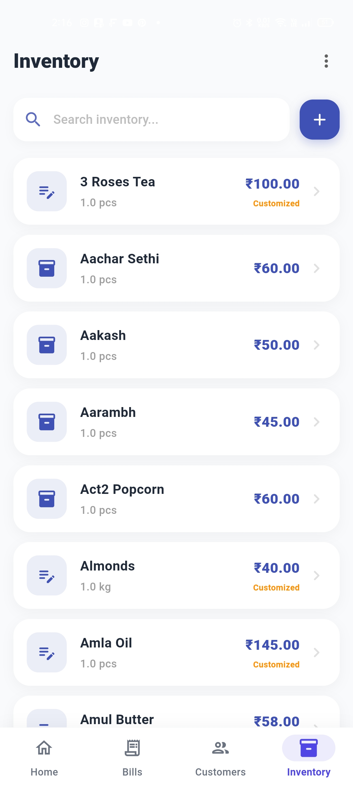
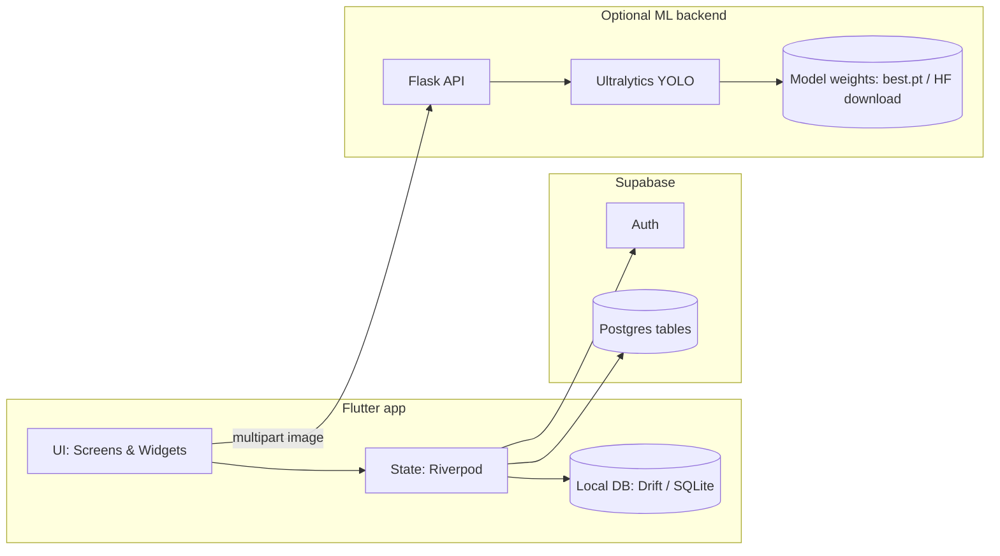

# Ledgerly

<p align="center">
	
</p>

Digitizing the traditional **Udhaar/Khata** (credit ledger) workflow for small retailers.

**Ledgerly** is an offline-first Flutter app backed by local SQLite (Drift) with **Supabase Auth + cloud sync**, and an **optional Flask + YOLO** service for camera-assisted item detection during billing.

---

## What you can do with it

- Track customers, dues, and credit history
- Create bills (manual cart) with discount and payment modes (credit vs upfront)
- Smart Billing Scan (optional): capture item photos and auto-suggest cart items using YOLO labels
- Manage inventory with a global base catalog + shop-specific overrides (price/quantity)
- Import/export CSV for customers, inventory, and transactions
- Draft SMS payment reminders (opens the native SMS composer)

---

## Product showcase

<div align="center">

<!-- Top Row: Video + Screenshots -->
<table>
<tr>
<td width="65%" valign="top">

<a href="assets/showcase/smart-billing-demo.mp4">
  
</a>

</td>

<td width="35%" valign="top">

<br/>
<br/>
<br/>
<br/>
<br/>


</td>
</tr>
</table>

</div>
---

## Tech stack

**Mobile**
- Flutter (Dart) + Material 3 UI
- Riverpod (state management)
- Drift ORM + SQLite (offline-first local storage)

**Cloud**
- Supabase (Auth + Postgres) for user accounts + sync

**ML backend (optional)**
- Flask API + Ultralytics YOLO
- Pillow + NumPy for image preprocessing

---

## Architecture



---

## Engineering highlights

- Offline-first: Drift + SQLite, with local UUID-based entities and `isSynced` flags for reconciliation
- Sync strategy: push unsynced local rows before pulling; incremental pulls; avoids overwriting pending edits
- Smart Billing Scan: camera capture → multipart upload to `/predict` → YOLO labels → inventory match by `yoloLabel` (fallback: name)

---

## Repository layout

- `app/` — Flutter mobile app (main project)
- `backend/` — Flask YOLO inference API (only needed for Smart Billing Scan)

---

## Quickstart (local development)

### Prerequisites

- Flutter SDK (Dart 3.5+)
- Android Studio / Xcode for running emulators/simulators
- Python 3.10+ (only required for the optional backend)

### 1) Configure the Flutter app

1. Go to `app/`
2. Copy `.env.example` to `.env`
3. Fill in your values:

```env
SUPABASE_URL=...
SUPABASE_ANON_KEY=...
FLASK_API_URL=http://10.0.2.2:5000
```

> Notes:
> - `FLASK_API_URL` is only used by the camera-based smart scan feature.
> - `.env` files are gitignored.

### 2) (Optional) Start the YOLO backend

See [backend/README.md](backend/README.md) for details.

### 3) Run the Flutter app

```bash
cd app
flutter pub get
flutter run
```

### Emulator networking

- Android emulator → `http://10.0.2.2:5000`
- iOS simulator → `http://localhost:5000`
- Physical device → your machine LAN IP (example: `http://192.168.0.5:5000`)

---

## Supabase tables (expected shape)

The sync layer expects these table names and columns (field names match what the app reads/writes):

- `base_inventory_items`: `id`, `name`, `default_price`, `yolo_label`, `base_quantity`, `quantity_metric`, `updated_at`
- `inventory_items`: `id`, `user_id`, `name`, `price`, `yolo_label`, `base_item_id`, `is_override`, `base_quantity`, `quantity_metric`
- `customers`: `id`, `user_id`, `name`, `phone`, `total_due`
- `transactions`: `id`, `user_id`, `customer_id`, `items_json`, `total_amount`, `timestamp`, `created_at`

Practical notes:
- Customers and transactions use UUIDs stored as text.
- `base_inventory_items` acts like a shared catalog; user-specific data is scoped via `user_id`.
- Recommended: enable RLS and only allow `user_id = auth.uid()` access on user-scoped tables.

---

## Documentation

- [app/README.md](app/README.md) — app setup, development, and data/sync notes
- [backend/README.md](backend/README.md) — API endpoints, model configuration, and deployment notes

---

## Security & publishing notes

- `.env` files and model weights are **not meant to be committed**.
- You do **not** need to provide your own model for Smart Billing Scan. The backend uses the project's Hugging Face model automatically when no local model file is found.
- `backend/best.pt` is gitignored. If you want to use your own weights, place them at `backend/best.pt` or set `MODEL_PATH` in `backend/.env`.

---